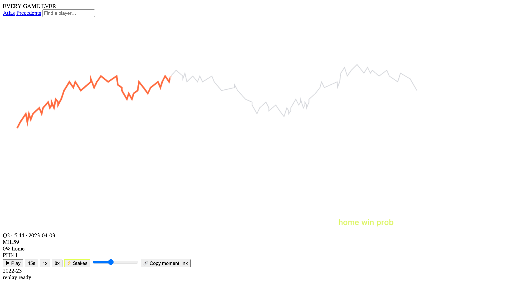

# Every Game Ever

**All 45,263 NBA games since 1946 — as data, as replay, as history.**
Every play, every score, every clock tick. Click any game and watch it
come back to life: the scoreboard ticks, the lead swings, and every
moment is judged against every other moment in the league’s record.

- **The Atlas** — 60 seasons of games as flow lines. Zoom from all of
  basketball history to one game.
- **The Time Machine** — replay the 2022-23 season play-by-play at any
  speed; moment links like `#/game/g_2022_hoopR_401469329/Q4/37` land
  you mid-moment, mid-lead-swing.
- **Stakes** — empirical win-probability from the real corpus: "this
  exact spot has happened N times; the trailing team won M."
- **Precedents** — the whole record judging itself: biggest blowouts,
  highest-scoring games, most lead changes, biggest comebacks.





## The dataset

Facts-only, license-clean, reproducible: `pipeline/ege.py build` derives
everything, `--license` scans outputs for banned content, and the release
bundle is a sha256-pinned tarball of pure Parquet. No prose, no internal
ids, no licensed feeds. See [docs/schema.md](docs/schema.md),
[docs/DATA-LICENSE.md](docs/DATA-LICENSE.md), and
[docs/DATA-COVERAGE.md](docs/DATA-COVERAGE.md) — including the honest
map of what the source record contains (real play-by-play exists for
2022-23; the other 59 seasons ship as full box-score history with
finals-derived precedent intelligence over all of it).

Five queries that make it worth opening DuckDB: see
[docs/duckdb-queries.md](docs/duckdb-queries.md).

## Run it

```sh
# site
cd web && npm ci && node scripts/build-atlas.mjs && npm run build && npm run preview

# dataset from scratch (needs source credentials; facts-only outputs)
cd pipeline && pip install -r requirements.txt
python ege.py build --all && python ege.py check --license
python ege.py wp && python ege.py precedents
python ege.py release --version 0.1.0
```

## Status

Built autonomously by the Every Game Ever loop (24h budget, 2026-08-07).
Management: `.loop/` supervisor (watchdog, heartbeat, wall-clock kill
switch, headless resume) with the paper trail in `.loop/phases.log`;
reports in `docs/WAKEUP-REPORT.md`.

## License

Code: MIT. Data: facts of public record — see
[docs/DATA-LICENSE.md](docs/DATA-LICENSE.md).
